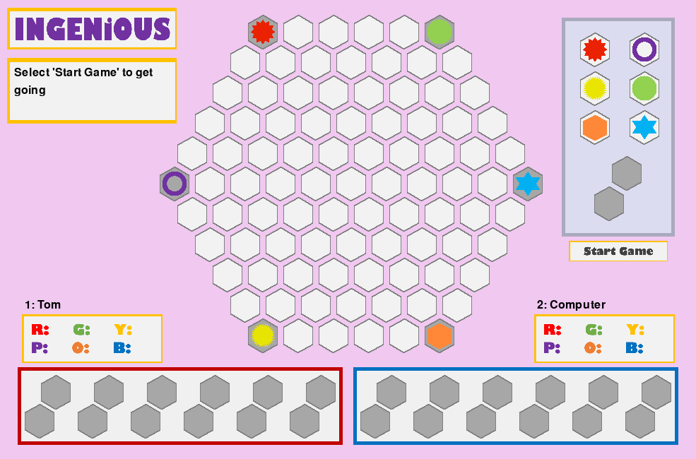

# ingenious rl

Code to train a reinforcement learning (RL) agent to play the [Ingenious board game](https://en.wikipedia.org/wiki/Ingenious_(board_game)) and to play against it.



## Usage

To set up:

```bash
virtualenv env -p python3
pip install -r requirements.txt
cd code
```

To play the agent, set your game settings in `code/settings_play.json`. Then run:

```bash
python main.py
```

To train a model, define your training config in `code/learn/configs`. Then run:

```bash
python -m learn.train <path/to/your/train/config>
```

## Background

The RL approach was based on both Tesauro's TD-Gammon and DeepMind's AlphaGo algorithms.
